# NavERP — Unified Core Data Model (ERD)

The shared "spine" every functional module (0–13, see [`NavERP.md`](NavERP.md)) points at. The design is held
together by three ideas:

1. **Party model** — `Party` + `PartyRole`: one record per real-world person/organization; *customer, vendor,
   supplier, employee, lead, contact, partner* are **roles**, not separate tables. This collapses the
   customer/vendor/employee duplication otherwise spread across CRM, Accounting, HR, SCM, Procurement and Sales.
2. **Two universal ledgers** — `StockMove` (inventory truth) and `JournalEntry`/`JournalLine` (financial truth).
   Every transaction posts to one or both. On-hand quantities and account balances are **derived** (aggregate
   queries), never stored as editable fields — that consistency is what makes it an ERP rather than 14 apps.
3. **Shared cross-module anchors** — a small set of backbone entities (`OrgUnit`, `Employment`, `Activity`,
   `Project`, `Asset`, `WorkOrder`, `Contract`, `QualityRecord`, `Document`, `AuditLog`) that more than one module
   reads or writes. Each module adds only its *own* domain tables on top of this spine (see the
   [Module coverage map](#module-coverage-map-0–13)).

> **Notation (Mermaid crow's-foot):** `||--o{` = one-to-many (mandatory→optional), `||--|{` = one-to-(one-or-many),
> `}o--||` = many-to-one, `}o--o{` = many-to-many. `PK` primary key, `FK` foreign key, `UK` unique key. Fields whose
> type is `"GenericFK"` are Django `contenttypes` generic relations (`content_type` + `object_id`) so the entity can
> attach to *any* model. Every business table also carries `tenant_id` (omitted from some relationship lines for
> readability) — tenancy is enforced everywhere (Module 0).

```mermaid
erDiagram
    %% ─── Platform · Tenancy · Access (Module 0) ───
    TENANT ||--o{ USER : "has"
    TENANT ||--o{ PARTY : "owns"
    TENANT ||--o{ ORG_UNIT : "structures"
    USER }o--|| PARTY : "is a person"
    ROLE ||--o{ USER : "assigned"
    ROLE }o--o{ PERMISSION : "grants"
    ORG_UNIT ||--o{ ORG_UNIT : "parent of"

    %% ─── Party model (one record · many roles) ───
    PARTY ||--o{ PARTY_ROLE : "acts as"
    PARTY ||--o{ ADDRESS : "has"
    PARTY ||--o{ CONTACT_METHOD : "has"
    PARTY ||--o{ PARTY_RELATIONSHIP : "from"
    PARTY ||--o{ PARTY_RELATIONSHIP : "to"
    PARTY ||--o{ EMPLOYMENT : "employed as"
    ORG_UNIT ||--o{ EMPLOYMENT : "in"

    %% ─── Product & inventory master ───
    ITEM_CATEGORY ||--o{ ITEM : "classifies"
    ITEM_CATEGORY ||--o{ ITEM_CATEGORY : "parent of"
    UOM ||--o{ ITEM : "base unit"
    UOM ||--o{ UOM_CONVERSION : "from"
    UOM ||--o{ UOM_CONVERSION : "to"
    ITEM ||--o{ PRICE_LIST_ITEM : "priced as"
    PRICE_LIST ||--o{ PRICE_LIST_ITEM : "contains"
    LOCATION ||--o{ LOCATION : "parent of"
    ITEM ||--o{ LOT_SERIAL : "tracked by"

    %% ─── Finance master ───
    CURRENCY ||--o{ EXCHANGE_RATE : "quoted"
    CURRENCY ||--o{ PRICE_LIST : "in"
    GL_ACCOUNT ||--o{ GL_ACCOUNT : "parent of"
    GL_ACCOUNT ||--o{ TAX_CODE : "posts to"

    %% ─── Procure-to-Pay (Modules 4 · 5 · 6) ───
    PARTY ||--o{ PURCHASE_ORDER : "vendor"
    PURCHASE_ORDER ||--|{ PURCHASE_ORDER_LINE : "contains"
    ITEM ||--o{ PURCHASE_ORDER_LINE : "ordered"

    %% ─── Order-to-Cash (Modules 1 · 8 · 9) ───
    PARTY ||--o{ SALES_ORDER : "customer"
    SALES_ORDER ||--|{ SALES_ORDER_LINE : "contains"
    ITEM ||--o{ SALES_ORDER_LINE : "sold"

    %% ─── Billing & settlement (Module 2) ───
    PARTY ||--o{ INVOICE : "bill party"
    INVOICE ||--|{ INVOICE_LINE : "contains"
    ITEM ||--o{ INVOICE_LINE : "billed"
    TAX_CODE ||--o{ INVOICE_LINE : "taxed"
    INVOICE ||--o{ PAYMENT_ALLOCATION : "settled by"
    PAYMENT ||--o{ PAYMENT_ALLOCATION : "applies"
    PARTY ||--o{ PAYMENT : "payer/payee"

    %% ─── Operations anchors (Modules 7 · 11 · 12 + production) ───
    PARTY ||--o{ PROJECT : "client"
    ORG_UNIT ||--o{ PROJECT : "owns"
    PROJECT ||--o{ ACTIVITY : "tracked by"
    ITEM ||--o{ ASSET : "instance of"
    LOCATION ||--o{ ASSET : "located at"
    PARTY ||--o{ ASSET : "custodian"
    GL_ACCOUNT ||--o{ ASSET : "capitalized to"
    ASSET ||--o{ WORK_ORDER : "maintained by"
    ITEM ||--o{ WORK_ORDER : "produces"
    LOCATION ||--o{ WORK_ORDER : "at"
    PARTY ||--o{ CONTRACT : "counterparty"

    %% ─── The two universal ledgers ───
    ITEM ||--o{ STOCK_MOVE : "moves"
    LOCATION ||--o{ STOCK_MOVE : "from"
    LOCATION ||--o{ STOCK_MOVE : "to"
    LOT_SERIAL ||--o{ STOCK_MOVE : "of"
    JOURNAL_ENTRY ||--|{ JOURNAL_LINE : "contains"
    GL_ACCOUNT ||--o{ JOURNAL_LINE : "posted to"
    PARTY ||--o{ JOURNAL_LINE : "subledger"

    %% ─── Cross-cutting (generic relations) ───
    TENANT ||--o{ ACTIVITY : "scoped"
    TENANT ||--o{ QUALITY_RECORD : "scoped"
    TENANT ||--o{ DOCUMENT : "scoped"
    TENANT ||--o{ AUDIT_LOG : "scoped"
    USER ||--o{ ACTIVITY : "owns"
    PARTY ||--o{ QUALITY_RECORD : "supplier"
    USER ||--o{ AUDIT_LOG : "by"

    TENANT {
        BigAutoField id PK
        CharField name
        SlugField slug UK
        CharField plan
        BooleanField is_active
    }
    USER {
        BigAutoField id PK
        ForeignKey tenant_id FK
        ForeignKey party_id FK "nullable - the person"
        ForeignKey role_id FK "nullable"
        EmailField email UK
        BooleanField is_tenant_admin
        BooleanField is_active
    }
    ROLE {
        BigAutoField id PK
        ForeignKey tenant_id FK
        CharField name
    }
    PERMISSION {
        BigAutoField id PK
        CharField codename UK
        CharField module
    }
    ORG_UNIT {
        BigAutoField id PK
        ForeignKey tenant_id FK
        CharField kind "company|branch|department|team|cost_center"
        CharField name
        ForeignKey parent_id FK "nullable"
    }
    PARTY {
        BigAutoField id PK
        ForeignKey tenant_id FK
        CharField kind "person | organization"
        CharField name
        CharField tax_id
    }
    PARTY_ROLE {
        BigAutoField id PK
        ForeignKey party_id FK
        CharField role "customer|vendor|supplier|employee|lead|contact|partner"
        CharField status
        DateField start_date
    }
    PARTY_RELATIONSHIP {
        BigAutoField id PK
        ForeignKey from_party_id FK
        ForeignKey to_party_id FK
        CharField kind "employee_of|contact_of|subsidiary_of|reports_to"
    }
    EMPLOYMENT {
        BigAutoField id PK
        ForeignKey tenant_id FK
        ForeignKey party_id FK "the employee"
        ForeignKey org_unit_id FK "department"
        ForeignKey manager_id FK "to PARTY, nullable"
        CharField job_title
        DateField hired_on
        CharField status "active|on_leave|terminated"
    }
    ADDRESS {
        BigAutoField id PK
        ForeignKey party_id FK
        CharField kind "billing|shipping|home"
        CharField line1
        CharField city
        CharField country
    }
    CONTACT_METHOD {
        BigAutoField id PK
        ForeignKey party_id FK
        CharField kind "email|phone|mobile"
        CharField value
    }
    ITEM {
        BigAutoField id PK
        ForeignKey tenant_id FK
        CharField sku UK
        CharField name
        CharField kind "stock|service|kit"
        ForeignKey category_id FK
        ForeignKey base_uom_id FK
        BooleanField is_lot_tracked
    }
    ITEM_CATEGORY {
        BigAutoField id PK
        ForeignKey tenant_id FK
        CharField name
        ForeignKey parent_id FK "nullable"
    }
    UOM {
        BigAutoField id PK
        CharField code "EA, BOX, KG"
        CharField name
    }
    UOM_CONVERSION {
        BigAutoField id PK
        ForeignKey from_uom_id FK
        ForeignKey to_uom_id FK
        DecimalField factor
    }
    PRICE_LIST {
        BigAutoField id PK
        ForeignKey tenant_id FK
        CharField name
        ForeignKey currency_id FK
        CharField kind "sale|purchase"
    }
    PRICE_LIST_ITEM {
        BigAutoField id PK
        ForeignKey price_list_id FK
        ForeignKey item_id FK
        DecimalField unit_price
        DateField valid_from
    }
    LOCATION {
        BigAutoField id PK
        ForeignKey tenant_id FK
        CharField kind "warehouse|zone|bin|store"
        CharField code
        ForeignKey parent_id FK "nullable"
    }
    LOT_SERIAL {
        BigAutoField id PK
        ForeignKey item_id FK
        CharField kind "lot|serial"
        CharField number
        DateField expiry_date
    }
    GL_ACCOUNT {
        BigAutoField id PK
        ForeignKey tenant_id FK
        CharField code UK
        CharField name
        CharField type "asset|liability|equity|income|expense"
        ForeignKey parent_id FK "nullable"
    }
    CURRENCY {
        BigAutoField id PK
        CharField code "USD, PKR, EUR"
        CharField name
    }
    EXCHANGE_RATE {
        BigAutoField id PK
        ForeignKey currency_id FK
        DateField date
        DecimalField rate
    }
    TAX_CODE {
        BigAutoField id PK
        ForeignKey tenant_id FK
        CharField name
        DecimalField rate_percent
        ForeignKey gl_account_id FK "tax payable/receivable"
    }
    PURCHASE_ORDER {
        BigAutoField id PK
        ForeignKey tenant_id FK
        ForeignKey vendor_id FK "to PARTY"
        CharField number UK "PO-#####"
        CharField status
        DateField order_date
    }
    PURCHASE_ORDER_LINE {
        BigAutoField id PK
        ForeignKey purchase_order_id FK
        ForeignKey item_id FK
        DecimalField qty
        DecimalField unit_price
    }
    SALES_ORDER {
        BigAutoField id PK
        ForeignKey tenant_id FK
        ForeignKey customer_id FK "to PARTY"
        CharField number UK "SO-#####"
        CharField status
        DateField order_date
    }
    SALES_ORDER_LINE {
        BigAutoField id PK
        ForeignKey sales_order_id FK
        ForeignKey item_id FK
        DecimalField qty
        DecimalField unit_price
    }
    INVOICE {
        BigAutoField id PK
        ForeignKey tenant_id FK
        ForeignKey party_id FK "bill-to / bill-from"
        CharField kind "receivable|payable"
        CharField number UK "INV-#####"
        CharField status
        DateField issue_date
        DecimalField total
    }
    INVOICE_LINE {
        BigAutoField id PK
        ForeignKey invoice_id FK
        ForeignKey item_id FK
        DecimalField qty
        DecimalField unit_price
        ForeignKey tax_code_id FK
    }
    PAYMENT {
        BigAutoField id PK
        ForeignKey tenant_id FK
        ForeignKey party_id FK
        CharField direction "in|out"
        DecimalField amount
        DateField paid_on
    }
    PAYMENT_ALLOCATION {
        BigAutoField id PK
        ForeignKey payment_id FK
        ForeignKey invoice_id FK
        DecimalField amount
    }
    PROJECT {
        BigAutoField id PK
        ForeignKey tenant_id FK
        CharField number UK "PRJ-#####"
        CharField name
        ForeignKey client_id FK "to PARTY, nullable"
        ForeignKey org_unit_id FK "owning unit"
        CharField status
        DateField start_date
        DecimalField budget
    }
    ACTIVITY {
        BigAutoField id PK
        ForeignKey tenant_id FK
        ForeignKey owner_id FK "to USER"
        ForeignKey party_id FK "related party, nullable"
        CharField kind "task|call|email|meeting|note"
        CharField content_type "GenericFK - related record"
        BigIntegerField object_id
        CharField status
        DateTimeField due_at
    }
    ASSET {
        BigAutoField id PK
        ForeignKey tenant_id FK
        CharField tag UK "AST-#####"
        CharField name
        ForeignKey item_id FK "nullable - catalog model"
        ForeignKey location_id FK
        ForeignKey custodian_id FK "to PARTY, nullable"
        ForeignKey gl_account_id FK "capitalization"
        CharField status "active|maintenance|retired|disposed"
        DecimalField acquisition_cost
    }
    WORK_ORDER {
        BigAutoField id PK
        ForeignKey tenant_id FK
        CharField number UK "WO-#####"
        CharField kind "production|maintenance"
        ForeignKey item_id FK "nullable - produced item"
        ForeignKey asset_id FK "nullable - serviced asset"
        ForeignKey location_id FK
        CharField status
        DateField scheduled_for
    }
    CONTRACT {
        BigAutoField id PK
        ForeignKey tenant_id FK
        CharField number UK "CTR-#####"
        ForeignKey party_id FK "counterparty"
        CharField kind "sales|purchase|nda|lease|service"
        CharField status
        DateField start_date
        DateField end_date
    }
    QUALITY_RECORD {
        BigAutoField id PK
        ForeignKey tenant_id FK
        CharField number UK "NCR-/CAPA-/QC-#####"
        CharField kind "ncr|capa|inspection|audit"
        ForeignKey party_id FK "supplier, nullable"
        CharField content_type "GenericFK - inspected object"
        BigIntegerField object_id
        CharField severity
        CharField status
    }
    STOCK_MOVE {
        BigAutoField id PK
        ForeignKey tenant_id FK
        ForeignKey item_id FK
        ForeignKey from_location_id FK "nullable"
        ForeignKey to_location_id FK "nullable"
        ForeignKey lot_serial_id FK "nullable"
        DecimalField qty
        CharField source_type "GenericFK"
        BigIntegerField source_id
        DateTimeField moved_at
    }
    JOURNAL_ENTRY {
        BigAutoField id PK
        ForeignKey tenant_id FK
        DateField date
        CharField memo
        CharField source_type "GenericFK"
        BigIntegerField source_id
        BooleanField is_posted
    }
    JOURNAL_LINE {
        BigAutoField id PK
        ForeignKey journal_entry_id FK
        ForeignKey gl_account_id FK
        ForeignKey party_id FK "nullable - subledger"
        DecimalField debit
        DecimalField credit
    }
    DOCUMENT {
        BigAutoField id PK
        ForeignKey tenant_id FK
        CharField content_type "GenericFK"
        BigIntegerField object_id
        FileField file
        CharField name
        CharField classification "public|internal|confidential"
        CharField version
    }
    AUDIT_LOG {
        BigAutoField id PK
        ForeignKey tenant_id FK
        ForeignKey user_id FK
        CharField content_type "GenericFK"
        BigIntegerField object_id
        CharField action "create|update|delete"
        JSONField changes
        DateTimeField at
    }
```

## Module coverage map (0–13)

Every module in [`NavERP.md`](NavERP.md) is built on the spine above: it **reuses** core entities (never copies
them) and **adds** only its own domain tables. This is what keeps NavERP one ERP instead of fourteen apps.

| # | Module | Reuses (core spine) | Adds (module-specific tables) |
|---|--------|---------------------|-------------------------------|
| 0 | System Admin & Security | `Tenant` `User` `Role` `Permission` `OrgUnit` `AuditLog` `Document` | Subscription, SubscriptionInvoice (SaaS platform→tenant billing — distinct from the spine `Invoice`, which is the tenant's own AR/AP), EncryptionKey, BrandingSetting, HealthMetric, FeatureFlag, SystemSetting, Notification, Webhook, ApiKey |
| 1 | CRM | `Party` (customer/contact/lead roles) · `Activity` · `Contract` · `SalesOrder` · `Invoice` | Lead, Opportunity, Campaign, Case/Ticket, KnowledgeArticle |
| 2 | Accounting & Finance | `GLAccount` · `JournalEntry`/`JournalLine` · `Invoice` · `Payment` · `TaxCode` · `Currency` · `Party` · `Asset` | FiscalPeriod, Bill, BankAccount, BankTransaction, Reconciliation, Budget, TaxReturn |
| 3 | HRM | `Party` (employee role) · `Employment` · `OrgUnit` · `Asset` · `Document` · `JournalEntry` (payroll) | LeaveRequest, AttendanceRecord, PayrollRun, PerformanceReview, JobRequisition, Candidate |
| 4 | SCM | `Party` (supplier) · `Item` · `Location` · `StockMove` · `PurchaseOrder` · `SalesOrder` · `WorkOrder` | Shipment, Carrier, RoutePlan, DemandForecast, ReturnAuthorization, BillOfMaterials |
| 5 | Inventory (IMS) | `Item` · `ItemCategory` · `UOM` · `Location` · `LotSerial` · `StockMove` · `PriceList` | GoodsReceipt, StockAdjustment, StockTransfer, CycleCount, ReorderRule |
| 6 | Procurement | `Party` (vendor) · `Item` · `PurchaseOrder` · `StockMove` · `JournalEntry` · `Contract` · `Document` | PurchaseRequisition, RFQ, VendorQuote, VendorScorecard, GoodsReceiptNote |
| 7 | Project Management | `Project` · `Activity` · `Employment` · `JournalEntry` (job cost) · `Invoice` · `Document` | ProjectTask, Milestone, Timesheet, RiskItem, ChangeRequest |
| 8 | Sales | `Party` (customer) · `SalesOrder` · `Invoice` · `Activity` · `PriceList` · `Contract` | Opportunity, Quote, Forecast, Territory, CommissionPlan |
| 9 | eCommerce | `Item` · `PriceList` · `SalesOrder` · `Payment` · `Party` (customer) · `StockMove` | Storefront, ProductListing, Cart, Promotion, ProductReview |
| 10 | Business Intelligence | *read-only over all spine entities (the two ledgers + masters)* | DataSource, Dashboard, Report, KpiDefinition, ScheduledReport |
| 11 | Asset Management | `Asset` · `WorkOrder` · `Item` · `Location` · `Party` (custodian/vendor) · `GLAccount` · `JournalEntry` (depreciation) | AssetCategory, DepreciationSchedule, AssetDisposal, WarrantyClaim, LeaseContract |
| 12 | Quality (QMS) | `QualityRecord` · `Party` (supplier) · `Item` · `LotSerial` · `WorkOrder` · `Document` | NonConformance (NCR), CapaAction, Inspection, QualityAudit, Calibration |
| 13 | Document Management (DMS) | `Document` (+ classification/version) · `Contract` · `Activity` · `AuditLog` | Folder, DocumentVersion, ApprovalRequest, RetentionPolicy, eForm |

## Django implementation notes

- **Multi-tenancy** — every model carries `tenant_id`. Enforce with a custom model `Manager` + middleware that
  injects the active tenant (shared-DB approach), or use **django-tenants** for schema-per-tenant isolation. This
  is Module 0 made real; the `admin` superuser has `tenant=None` by design.
- **Party model** — `Party` + `PartyRole` replace separate customer/vendor/employee tables. A login `User` links
  to the `Party` that represents that person (`party_id`, nullable — most parties never log in). HR's `Employment`
  carries the job/department/manager facts; "Employee" itself is just a `Party` with a `PartyRole`.
- **Two ledgers** — `StockMove` and `JournalEntry`/`JournalLine` are append-only. Never edit balances; **derive**
  on-hand (`StockMove.objects.filter(...).aggregate(Sum('qty'))`) and account balances (sum of debits − credits).
  Wrap each business action (post invoice, receive goods, run payroll, depreciate an asset, complete a work order)
  in a **service function** inside `transaction.atomic()` that writes the move(s) and the balanced journal entry
  together.
- **Cross-module anchors** — `Project`, `Asset`, `WorkOrder`, `Contract`, and `Activity` are shared so that, e.g.,
  Accounting can post depreciation against the *same* `Asset` row that Asset Management maintains, and Project
  Management bills the *same* `Project` that Accounting job-costs. Module-specific detail (a `Quote`, a `Lead`, a
  `LeaveRequest`) FKs **by string** into these anchors and into the masters (`models.ForeignKey('core.Party', …)`)
  rather than re-declaring them.
- **Generic relations** — `Document`, `Activity`, `QualityRecord`, `AuditLog`, and the `source` on each ledger row
  use Django's `contenttypes` framework (`GenericForeignKey`), so any model gets attachments / a task timeline / a
  quality record / history / traceability. Consider **django-auditlog** or **django-simple-history** for audit;
  **django-guardian** for object-level permissions (Django's built-in `Group`/`Permission` already covers
  role-based access). The DMS module (13) builds folders, versioning, and approval workflows on top of `Document`.
- **Source traceability** — `StockMove` and `JournalEntry` carry a generic `source` (`content_type` + `object_id`)
  pointing back to the PO/SO/Invoice/WorkOrder/PayrollRun that created them, so every ledger row is explainable.
- **Money & quantities** — always `DecimalField` (never float), with explicit `max_digits`/`decimal_places`; keep
  amounts in the document currency plus a posted base-currency amount on journal lines.
- **Numbering** — human-readable per-tenant sequences (`INV-#####`, `PO-#####`, `SO-#####`, `PRJ-#####`,
  `WO-#####`, `CTR-#####`, `NCR-#####`, …) generated in `save()` with an existence guard; `unique_together
  (tenant, number)`. See `apps/tenants/Invoice.save()` as the reference implementation.
