# NavERP — Unified Core Data Model (ERD)

The shared "spine" every functional module points at. Two ideas carry most of the design:

1. **Party model** — `Party` + `PartyRole`: one record per real-world person/organization; *customer, vendor, supplier, employee, lead, contact* are **roles**, not separate tables. This collapses the customer/vendor/employee duplication spread across CRM, Accounting, HR, SCM, Procurement and Sales.
2. **Two universal ledgers** — `StockMove` (inventory truth) and `JournalEntry`/`JournalLine` (financial truth). Every transaction posts to one or both. On-hand quantities and account balances are **derived** (aggregate queries), never stored as editable fields — that consistency is what makes it an ERP rather than 14 apps.

```mermaid
erDiagram
    %% ─── Platform · Tenancy · Access ───
    TENANT ||--o{ USER : "has"
    TENANT ||--o{ PARTY : "owns"
    USER }o--|| PARTY : "is a person"
    USER }o--o{ ROLE : "assigned"
    ROLE }o--o{ PERMISSION : "grants"

    %% ─── Party model (one record · many roles) ───
    PARTY ||--o{ PARTY_ROLE : "acts as"
    PARTY ||--o{ ADDRESS : "has"
    PARTY ||--o{ CONTACT_METHOD : "has"
    PARTY ||--o{ PARTY_RELATIONSHIP : "from"
    PARTY ||--o{ PARTY_RELATIONSHIP : "to"

    %% ─── Product & inventory master ───
    ITEM_CATEGORY ||--o{ ITEM : "classifies"
    ITEM_CATEGORY ||--o{ ITEM_CATEGORY : "parent of"
    UOM ||--o{ ITEM : "base unit"
    UOM ||--o{ UOM_CONVERSION : "from"
    UOM ||--o{ UOM_CONVERSION : "to"
    ITEM ||--o{ PRICE_LIST_ITEM : "priced as"
    PRICE_LIST ||--o{ PRICE_LIST_ITEM : "contains"
    LOCATION ||--o{ LOCATION : "parent of"
    ITEM ||--o{ LOT_SERIAL : "tracked by"

    %% ─── Finance master ───
    CURRENCY ||--o{ EXCHANGE_RATE : "quoted"
    CURRENCY ||--o{ PRICE_LIST : "in"
    GL_ACCOUNT ||--o{ GL_ACCOUNT : "parent of"
    GL_ACCOUNT ||--o{ TAX_CODE : "posts to"

    %% ─── Procure-to-Pay ───
    PARTY ||--o{ PURCHASE_ORDER : "vendor"
    PURCHASE_ORDER ||--|{ PURCHASE_ORDER_LINE : "contains"
    ITEM ||--o{ PURCHASE_ORDER_LINE : "ordered"

    %% ─── Order-to-Cash ───
    PARTY ||--o{ SALES_ORDER : "customer"
    SALES_ORDER ||--|{ SALES_ORDER_LINE : "contains"
    ITEM ||--o{ SALES_ORDER_LINE : "sold"

    %% ─── Billing & settlement ───
    PARTY ||--o{ INVOICE : "bill party"
    INVOICE ||--|{ INVOICE_LINE : "contains"
    ITEM ||--o{ INVOICE_LINE : "billed"
    TAX_CODE ||--o{ INVOICE_LINE : "taxed"
    INVOICE ||--o{ PAYMENT_ALLOCATION : "settled by"
    PAYMENT ||--o{ PAYMENT_ALLOCATION : "applies"
    PARTY ||--o{ PAYMENT : "payer/payee"

    %% ─── The two universal ledgers ───
    ITEM ||--o{ STOCK_MOVE : "moves"
    LOCATION ||--o{ STOCK_MOVE : "from"
    LOCATION ||--o{ STOCK_MOVE : "to"
    LOT_SERIAL ||--o{ STOCK_MOVE : "of"
    JOURNAL_ENTRY ||--|{ JOURNAL_LINE : "contains"
    GL_ACCOUNT ||--o{ JOURNAL_LINE : "posted to"
    PARTY ||--o{ JOURNAL_LINE : "subledger"

    %% ─── Cross-cutting (generic relations) ───
    TENANT ||--o{ DOCUMENT : "scoped"
    TENANT ||--o{ AUDIT_LOG : "scoped"
    USER ||--o{ AUDIT_LOG : "by"

    TENANT {
        BigAutoField id PK
        CharField name
        SlugField slug UK
        CharField plan
        BooleanField is_active
    }
    USER {
        BigAutoField id PK
        ForeignKey tenant_id FK
        ForeignKey party_id FK "nullable - the person"
        EmailField email UK
        BooleanField is_active
    }
    ROLE {
        BigAutoField id PK
        ForeignKey tenant_id FK
        CharField name
    }
    PERMISSION {
        BigAutoField id PK
        CharField codename UK
        CharField module
    }
    PARTY {
        BigAutoField id PK
        ForeignKey tenant_id FK
        CharField kind "person | organization"
        CharField name
        CharField tax_id
    }
    PARTY_ROLE {
        BigAutoField id PK
        ForeignKey party_id FK
        CharField role "customer|vendor|supplier|employee|lead|contact|partner"
        CharField status
        DateField start_date
    }
    PARTY_RELATIONSHIP {
        BigAutoField id PK
        ForeignKey from_party_id FK
        ForeignKey to_party_id FK
        CharField kind "employee_of|contact_of|subsidiary_of|reports_to"
    }
    ADDRESS {
        BigAutoField id PK
        ForeignKey party_id FK
        CharField kind "billing|shipping|home"
        CharField line1
        CharField city
        CharField country
    }
    CONTACT_METHOD {
        BigAutoField id PK
        ForeignKey party_id FK
        CharField kind "email|phone|mobile"
        CharField value
    }
    ITEM {
        BigAutoField id PK
        ForeignKey tenant_id FK
        CharField sku UK
        CharField name
        CharField kind "stock|service|kit"
        ForeignKey category_id FK
        ForeignKey base_uom_id FK
        BooleanField is_lot_tracked
    }
    ITEM_CATEGORY {
        BigAutoField id PK
        ForeignKey tenant_id FK
        CharField name
        ForeignKey parent_id FK "nullable"
    }
    UOM {
        BigAutoField id PK
        CharField code "EA, BOX, KG"
        CharField name
    }
    UOM_CONVERSION {
        BigAutoField id PK
        ForeignKey from_uom_id FK
        ForeignKey to_uom_id FK
        DecimalField factor
    }
    PRICE_LIST {
        BigAutoField id PK
        ForeignKey tenant_id FK
        CharField name
        ForeignKey currency_id FK
        CharField kind "sale|purchase"
    }
    PRICE_LIST_ITEM {
        BigAutoField id PK
        ForeignKey price_list_id FK
        ForeignKey item_id FK
        DecimalField unit_price
        DateField valid_from
    }
    LOCATION {
        BigAutoField id PK
        ForeignKey tenant_id FK
        CharField kind "warehouse|zone|bin|store"
        CharField code
        ForeignKey parent_id FK "nullable"
    }
    LOT_SERIAL {
        BigAutoField id PK
        ForeignKey item_id FK
        CharField kind "lot|serial"
        CharField number
        DateField expiry_date
    }
    GL_ACCOUNT {
        BigAutoField id PK
        ForeignKey tenant_id FK
        CharField code UK
        CharField name
        CharField type "asset|liability|equity|income|expense"
        ForeignKey parent_id FK "nullable"
    }
    CURRENCY {
        BigAutoField id PK
        CharField code "USD, PKR, EUR"
        CharField name
    }
    EXCHANGE_RATE {
        BigAutoField id PK
        ForeignKey currency_id FK
        DateField date
        DecimalField rate
    }
    TAX_CODE {
        BigAutoField id PK
        ForeignKey tenant_id FK
        CharField name
        DecimalField rate_percent
        ForeignKey gl_account_id FK "tax payable/receivable"
    }
    PURCHASE_ORDER {
        BigAutoField id PK
        ForeignKey tenant_id FK
        ForeignKey vendor_id FK "to PARTY"
        CharField number UK
        CharField status
        DateField order_date
    }
    PURCHASE_ORDER_LINE {
        BigAutoField id PK
        ForeignKey purchase_order_id FK
        ForeignKey item_id FK
        DecimalField qty
        DecimalField unit_price
    }
    SALES_ORDER {
        BigAutoField id PK
        ForeignKey tenant_id FK
        ForeignKey customer_id FK "to PARTY"
        CharField number UK
        CharField status
        DateField order_date
    }
    SALES_ORDER_LINE {
        BigAutoField id PK
        ForeignKey sales_order_id FK
        ForeignKey item_id FK
        DecimalField qty
        DecimalField unit_price
    }
    INVOICE {
        BigAutoField id PK
        ForeignKey tenant_id FK
        ForeignKey party_id FK "bill-to / bill-from"
        CharField kind "receivable|payable"
        CharField number UK
        CharField status
        DateField issue_date
        DecimalField total
    }
    INVOICE_LINE {
        BigAutoField id PK
        ForeignKey invoice_id FK
        ForeignKey item_id FK
        DecimalField qty
        DecimalField unit_price
        ForeignKey tax_code_id FK
    }
    PAYMENT {
        BigAutoField id PK
        ForeignKey tenant_id FK
        ForeignKey party_id FK
        CharField direction "in|out"
        DecimalField amount
        DateField paid_on
    }
    PAYMENT_ALLOCATION {
        BigAutoField id PK
        ForeignKey payment_id FK
        ForeignKey invoice_id FK
        DecimalField amount
    }
    STOCK_MOVE {
        BigAutoField id PK
        ForeignKey tenant_id FK
        ForeignKey item_id FK
        ForeignKey from_location_id FK "nullable"
        ForeignKey to_location_id FK "nullable"
        ForeignKey lot_serial_id FK "nullable"
        DecimalField qty
        CharField source_type "GenericFK"
        BigIntegerField source_id
        DateTimeField moved_at
    }
    JOURNAL_ENTRY {
        BigAutoField id PK
        ForeignKey tenant_id FK
        DateField date
        CharField memo
        CharField source_type "GenericFK"
        BigIntegerField source_id
        BooleanField is_posted
    }
    JOURNAL_LINE {
        BigAutoField id PK
        ForeignKey journal_entry_id FK
        ForeignKey gl_account_id FK
        ForeignKey party_id FK "nullable - subledger"
        DecimalField debit
        DecimalField credit
    }
    DOCUMENT {
        BigAutoField id PK
        ForeignKey tenant_id FK
        CharField content_type "GenericFK"
        BigIntegerField object_id
        FileField file
        CharField name
    }
    AUDIT_LOG {
        BigAutoField id PK
        ForeignKey tenant_id FK
        ForeignKey user_id FK
        CharField content_type "GenericFK"
        BigIntegerField object_id
        CharField action "create|update|delete"
        JSONField changes
        DateTimeField at
    }
```

## Django implementation notes

- **Multi-tenancy** — every model carries `tenant_id`. Enforce with a custom model `Manager` + middleware that injects the active tenant (shared-DB approach), or use **django-tenants** for schema-per-tenant isolation. This is Module 0 made real.
- **Party model** — `Party` + `PartyRole` replace separate customer/vendor/employee tables. A login `User` links to the `Party` that represents that person (`party_id`, nullable — most parties never log in).
- **Two ledgers** — `StockMove` and `JournalEntry`/`JournalLine` are append-only. Never edit balances; **derive** on-hand (`StockMove.objects.filter(...).aggregate(Sum('qty'))`) and account balances (sum of debits − credits). Wrap each business action (post invoice, receive goods) in a **service function** inside `transaction.atomic()` that writes the move(s) and the balanced journal entry together.
- **Generic relations** — `Document` and `AuditLog` use Django's `contenttypes` framework (`GenericForeignKey`) so any model gets attachments/history. Consider **django-auditlog** or **django-simple-history** for audit; **django-guardian** for object-level permissions (Django's built-in `Group`/`Permission` already covers role-based access).
- **Source traceability** — `StockMove` and `JournalEntry` carry a generic `source` (`content_type` + `object_id`) pointing back to the PO/SO/Invoice that created them, so every ledger row is explainable.
- **Money & quantities** — always `DecimalField` (never float), with explicit `max_digits`/`decimal_places`; keep amounts in the document currency plus a posted base-currency amount on journal lines.
